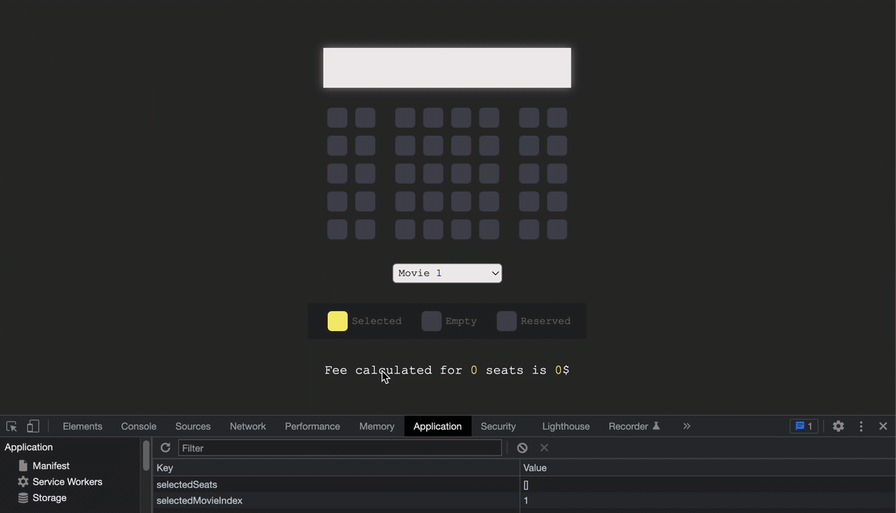

<h1>Movie Seat (Ticket) Application</h1>

<h4>This application is created with</h5>
<ul>
    <li>HTML</li>
    <li>CSS</li>
    <li>Vanilla JavaScript</li>
</ul>

<h4>Used ES6 (ECMAScript 6) Features:</h4>
<ul>
    <li>map function</li>
    <li>arrow function</li>
    <li>"..." (spread) operator</li>
</ul>

You can toggle reserved seats just by clicking on.
 

It automatically calculates number of reserved seats and total price with respect to the movie ticket price.

All the data stored at localStorage as index number of reserved seat and selected movie.

 

